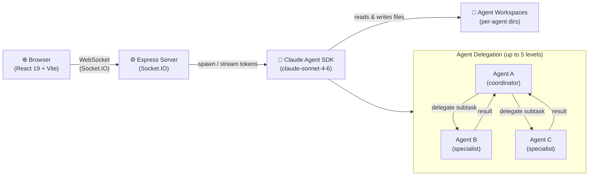

<div align="center">
  
  <h1>Tonkatsu</h1>
  <p><strong>Stop managing AI agents. Start deploying teams.</strong><br/>A self-hosted virtual office where Claude Code agents collaborate autonomously, delegate to each other, and stream every token live to your browser.</p>

  [](LICENSE)
  [](https://github.com/pierredosne-fin/tonkatsu-ai/actions)
  [](https://pierredosne-fin.github.io/tonkatsu-ai/)
  [](https://nodejs.org)

  <br/>
  <video src="docs/static/img/introduction.mp4" controls width="100%"></video>
</div>

---

> ⚡ **30-second install**
>
> ```bash
> git clone https://github.com/pierredosne-fin/tonkatsu-ai.git
> cd tonkatsu-ai
> npm install
> echo "ANTHROPIC_API_KEY=sk-ant-..." > server/.env
> npm run dev
> ```

---

## Why Tonkatsu?

Most AI agent frameworks hand you a Python library and tell you to figure out the wiring. Tonkatsu is different:

- **Self-hosted privacy** — your Anthropic API key and every byte of agent memory stay on your own server. Nothing touches a third-party cloud.
- **Real-time streaming** — every token from every agent streams live to your browser via Socket.IO. You see exactly what each agent is thinking, writing, and deciding — as it happens.
- **Agent delegation** — agents hand off subtasks to other agents automatically, up to 5 levels deep. You talk to the coordinator; it orchestrates the rest. No manual chaining, no glue code.

---

## What is Tonkatsu?

Tonkatsu is an open-source platform where you build a team of AI agents, give each one a role and a workspace, and watch them collaborate — without babysitting every step.

- **Visual office grid** — agents occupy rooms in a 5×3 grid. See who is running, idle, or waiting for your input at a glance.
- **Real-time streaming** — every token streams live to the browser via Socket.IO. No polling, no refresh.
- **Agent delegation** — agents hand off work to each other automatically, up to 5 levels deep. You talk to the coordinator; it handles the rest.
- **Persistent memory** — agents remember what they've learned across sessions. Conversations survive server restarts.
- **Repo-backed agents** — tie an agent to a git repository. It gets its own branch and worktree, reads and commits code, and keeps identity files private.
- **SSH auto-setup** — upload a global SSH key once via the API; the server installs it as `~/.ssh/id_rsa` and pre-populates GitHub's `known_hosts` so `git` and `gh` commands work natively inside Docker.
- **Cron scheduling** — run agents on a cron expression. Daily reports, monitoring alerts, data syncs — fully automated.
- **Templates** — snapshot any live agent or team configuration and reinstantiate it with one API call.
- **Self-hosted** — your Anthropic API key and data never leave your server.

---

## Quick start

### Prerequisites

- Node.js 20+
- An [Anthropic API key](https://console.anthropic.com)

### Install & run

```bash
git clone https://github.com/pierredosne-fin/tonkatsu-ai.git
cd tonkatsu-ai
npm install
```

Create `server/.env`:

```env
ANTHROPIC_API_KEY=sk-ant-...
PORT=3001   # optional, defaults to 3001
```

```bash
npm run dev
```

| Service | URL |
|---------|-----|
| App + API | http://localhost:5173 |
| Docs (local) | http://localhost:3000 (`npm run docs:dev`) |

---

## Docker

```bash
docker build -t tonkatsu .
docker run -e ANTHROPIC_API_KEY=sk-ant-... -p 5173:5173 tonkatsu
```

The Docker image bundles **gh** (GitHub CLI), **gcloud**, and **bq** (Google Cloud SDK) so agents can run git, GitHub, and BigQuery commands natively.

Pass `GITHUB_TOKEN` to enable `gh` API operations (PRs, issues, etc.):

```bash
docker run \
  -e ANTHROPIC_API_KEY=sk-ant-... \
  -e GITHUB_TOKEN=ghp_... \
  -p 5173:5173 \
  tonkatsu
```

Production images are published to GitHub Container Registry on every release:

```bash
docker pull ghcr.io/pierredosne-fin/tonkatsu-ai:latest
```

---

## Tech stack

| Layer | Technology |
|-------|-----------|
| Backend | Express + Socket.IO, ESM TypeScript (`tsx watch`) |
| Frontend | React 19 + Vite, Zustand |
| AI | `@anthropic-ai/claude-agent-sdk` · `claude-sonnet-4-6` |
| Container | Docker (multi-stage, `node:20-slim`) · GitHub Container Registry |
| Bundled CLIs | `gh` (GitHub CLI) · `gcloud` · `bq` (Google Cloud SDK) |
| CI/CD | GitHub Actions · semantic-release |
| Docs | Docusaurus 3 · GitHub Pages |

---

## Project structure

```
.
├── client/               # React 19 + Vite frontend
│   └── src/
├── server/               # Express + Socket.IO backend
│   └── src/
│       └── services/
│           ├── agentService.ts       # Agent lifecycle & persistence
│           ├── claudeService.ts      # Claude SDK execution & delegation
│           ├── persistenceService.ts # Disk state (agents, schedules, templates)
│           └── roomService.ts        # 5×3 room grid management
├── docs/                 # Docusaurus documentation site
├── workspaces/           # Agent workspaces on disk (gitignored)
├── repos/                # Bare git clones for repo-backed agents (gitignored)
├── Dockerfile
└── CLAUDE.md
```

---

## Architecture



---

## CI/CD

| Workflow | Trigger | What it does |
|----------|---------|-------------|
| `pr-checks.yml` | PR → `main` | Lint · type-check · build |
| `release.yml` | Push → `main` | Lint · build · Docker push (`dev-<sha>`) |
| `manual-release.yml` | Manual (`workflow_dispatch`) | Semantic release · Docker (`vX.Y.Z` + `latest`) · Docs deploy |
| `docs.yml` | Push → `main` | Build & deploy Docusaurus to GitHub Pages |

Trigger a release manually from **Actions → Manual Release → Run workflow**.

---

## Documentation

Full documentation is available at **[pierredosne-fin.github.io/tonkatsu-ai](https://pierredosne-fin.github.io/tonkatsu-ai/)**.

To run docs locally:

```bash
cd docs && npm install && npm run start
```

---

## How it compares

| Feature | Tonkatsu | CrewAI | AutoGen | LangGraph |
|---------|----------|--------|---------|-----------|
| Self-hosted | ✅ Fully self-hosted | ⚠️ Cloud offering exists | ✅ Self-hosted | ✅ Self-hosted |
| Real-time UI | ✅ Live token streaming | ❌ Code-only | ❌ Code-only | ❌ Code-only |
| Agent-to-agent delegation | ✅ Up to 5 levels deep | ✅ Role-based crews | ✅ Group chat model | ⚠️ Manual graph wiring |
| Git repo integration | ✅ Branch + worktree per agent | ❌ | ❌ | ❌ |
| Persistent memory | ✅ Survives restarts | ⚠️ Plugin-based | ⚠️ Plugin-based | ⚠️ Plugin-based |
| Cron scheduling | ✅ Built-in | ❌ | ❌ | ❌ |
| Browser-based monitoring | ✅ Visual office grid | ❌ | ❌ | ⚠️ LangSmith (external) |
| Primary interface | Both (UI + API) | Code | Code | Code |
| Underlying model | Claude only | Any | Any | Any |

---

## Contributing

1. Fork the repo and create a branch from `main`
2. Make your changes — every PR runs lint, type-check, and build automatically
3. Open a pull request against `main`

Commits follow [Conventional Commits](https://www.conventionalcommits.org/) (`feat:`, `fix:`, `chore:`, etc.) — this drives automatic versioning via semantic-release.

---

## License

Copyright 2024-present the Tonkatsu contributors.

Licensed under the **Apache License, Version 2.0**. See [LICENSE](LICENSE) for the full text.

> You may obtain a copy of the License at http://www.apache.org/licenses/LICENSE-2.0
